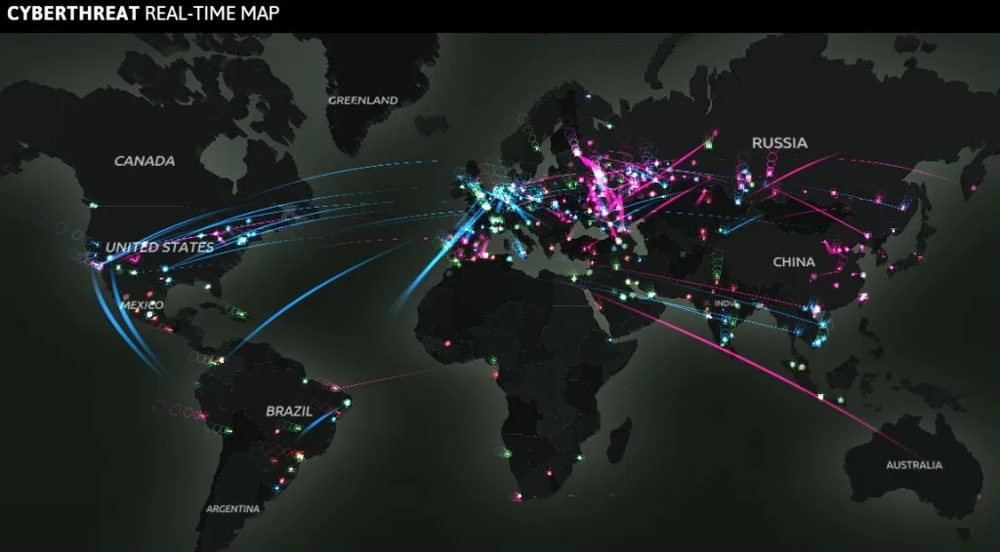

### Feedback from Andrew Frost and Raihan Ahmed from Rated 'V' for Visualization

#### Questions:
1. How do you organize your views? (Raihan)
2. What do the data of the force-directed tree look like? Does it contain the amount, location, or dates? What information is encoded in the visualization?  (Andrew)
3. Borrowing the design from cyber attacks visualization, you can integrate a map to show the flow of cryptocurrency in the world, i.e., who is producing and who is consuming.  (Andrew)
    
4. The ranking information for the cryptocurrency share can be shown more explicitly, probably via a redesign like the ranking lines. (Andrew)
    
5. Because the activity of cryptocurrency is very seasonal, applying a color scale for the brush can reveal patterns of the trend. (Andrew)
6. Colors are not sensibly used in the plotted prototype and should be added in the later versions for effect. (Raihan)
